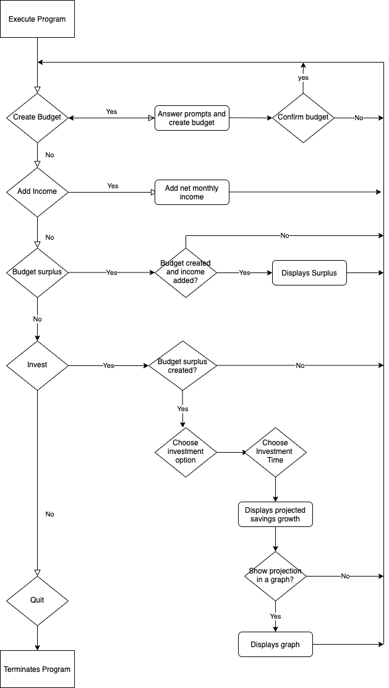

# Link to source control repository

https://github.com/VinsonWang92/T1A3---Vinson.git

#Link to Trello project management board
https://trello.com/b/F9iW6HYq/terminal-application 

# Description

TerminalBudget is a simple application that allows you to enter a mock budget and see the effects of having a budget surplus and the long term of effects of investing that surplus. It takes only integers as inputs from the user, is simple, easy to use and information is displayed clearly in tables and graphs.

# System Requirements

Application has only been tested on Mac OS Catalina 10.15.6

Any system with Ruby installed and the following gems can run the application:
- gem "ascii-charts", "~> 0.9.3"
- gem "colorize", "~> 0.8.1"
- gem "terminal-table", "~> 1.8"
- gem "tty-prompt"

## **How to Install and Run**

- If you do not have Ruby on your computer, follow these instructions to [download and install](https://www.ruby-lang.org/en/documentation/installation/).
- Clone the project files onto your computer from the source code here: https://github.com/Lou-Flan/bot-dog.
- On the terminal command line, navigate to the Terminal Finance directory you just cloned
- If you do not have the 'bundler' gem installed on your computer, please enter the following code.

```
$ install bundler
```

- Once 'bundler' has been installed, enter the following code to install the gems required for the application.

```
$ bundle install 
```

```
$ ruby terminal-budget.rb
```


# R5 - Software Development Plan
## Develop a statement of purpose and scope for your application. It must include:
- describe at a high level what the application will do
- identify the problem it will solve and explain why you are developing it
- identify the target audience 
- explain how a member of the target audience will use it

The application will allow users to create a budget using preset prompts for usual expenses that every day Australians will incur. Then it allows them to check the budget with their net income to see what their surplus or deficit is, if there is a deficit it will ask them to remake their budget so that they are in a surplus. Once we have a surplus it will give them options to see what they can do if they invest the money, set goals and potential yields for the investment which will then allow them to see how long it will take for them to reach their goals if they stick to their budget and if their income remains constant.

The problem that the application will solve is to introduce the idea of budgeting and how financial goals can be reached. Simple personal finance is taught poorly in our schooling system and people do not understand the implications of not having adequate savings and think that financial goals are too hard to achieve. A budget will allow for people to hold themselves accountable and spend without feeling guilty as they know how much disposable income they have and will still be able to reach their financial goals depending on what they are. 

The target audience will be people with a stable income that feel that they are not able to save and are not disciplined with their money and don't plan for future expenses. The target audience is essentially anybody that uses Afterpay to show that it is better to budget and be disciplined rather than spend money that you have not yet earnt. Rather than targeting them to overconsume, it will aim to help users spend within their means.

A user will set the budget first and if there is no surplus the budget needs to be amended before they can continue, they must have a budget surplus or they'll never have savings and any unexpected financial costs will put them into high interest debt and they will be trapped in a debt cycle if they do not alter their financial choices. Once they set a budget that they feel that they can comply with that comes with a surplus based on their income, it will allow them to see the power of compounding interest and how a little savings each month can lead to a substantially larger amount than they thought possible if returns are stable. This should motivate them to further save and spend within their means. 


# R6
## Develop a list of features that will be included in the application. It must include:
- at least THREE features
- describe each feature
The three main features that would be included in the application are:
- Ability to create a budget 
    - you will be prompted to provide details of categories of spending that should be relevant to most if not all Australians. This will allow you to have an idea of your monthly spendings and how much income you will need to maintain your current lifestyle. The figures may surprise some people
- Summaries of your data entered to be displayed in tables
    - all the data you enter, whether it be your budget, income or how long you're looking to invest for will return and display in a table the data that you have entered. If there are incorrect figures you can simply just go and re-enter the figures by choosing the option again until the data is correct
- Graphs will be output to show trajectory of your savings/investment goals based on data input by user
    - this will be a visual representation which may be helpful to demonstrate the power of compounding interest which is exponential rather than geometric. By having this tool it allows the user to see the relationship between time and investment returns and how the earlier you get started in investing the bigger the rewards will be, which may motivate some to start right away as opposed to delay the implementation of their budget. 

# R7
## Develop an outline of the user interaction and experience for the application.
Your outline must include:
- how the user will find out how to interact with / use each feature
- how the user will interact with / use each feature
- how errors will be handled by the application and displayed to the user

The user will be prompted via text on their console on how to use each feature. Every action taken will provide a prompt to further actions or to return to menu. 

All interactions are text based and the user should be entering all integers. 

If they enter anything else other than integers they will be provided with an error message and will be taken back to the menu or they will be shown a message where they will be notified that it was an invalid input and a default value was placed instead of their input.

# R8



